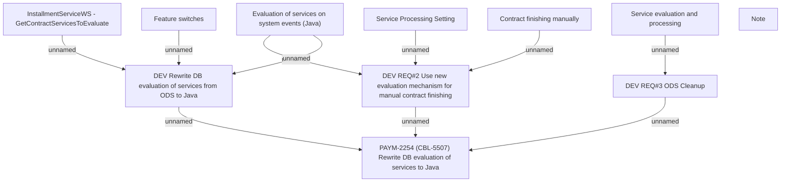

# PAYM-2254 (CBL-5507) Rewrite DB evaluation of services to Java

- **Diagram Type**: Custom
- **Package**: HomerSelect/BSL/Requirements Model/In process/ISPAY/PAYM-2254 (CBL-5507) Rewrite DB evaluation of services to Java
- **Diagram ID**: 119183
- **Elements**: 11
- **Connectors**: 10

