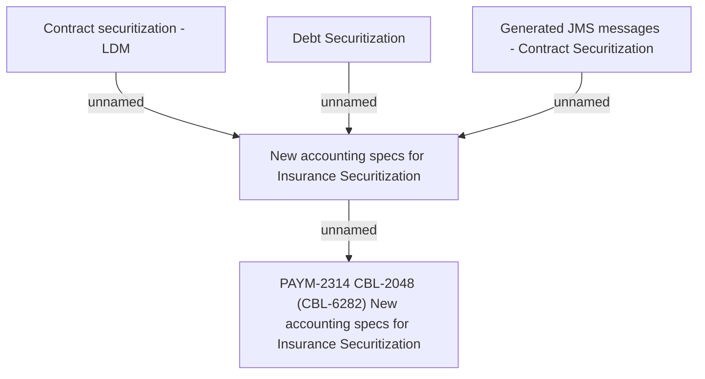

# PAYM-2314 CBL-2048 (CBL-6282) New accounting specs for Insurance Securitization

- **Diagram Type**: Custom
- **Package**: HomerSelect/BSL/Requirements Model/In process/ISPAY/PAYM-2314 CBL-2048 (CBL-6282) New accounting specs for Insurance Securitization
- **Diagram ID**: 117071
- **Elements**: 5
- **Connectors**: 4

