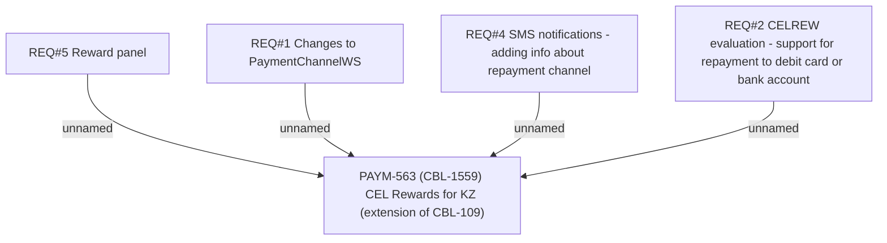

# PAYM-563 (CBL-1559) CEL Rewards for KZ (extension of CBL-109)

```mermaid
graph TD
    REQ_5_Reward_panel["REQ#5 Reward panel"]
    REQ_1_Changes_to_PaymentChannelWS["REQ#1 Changes to PaymentChannelWS"]
    REQ_4_SMS_notifications_adding_info_about_repayment_channel["REQ#4 SMS notifications - adding info about repayment channel"]
    REQ_2_CELREW_evaluation_support_for_repayment_to_debit_card_["REQ#2 CELREW evaluation - support for repayment to debit card or bank account"]
    PAYM_563_CBL_1559_CEL_Rewards_for_KZ_extension_of_CBL_109["PAYM-563 (CBL-1559) CEL Rewards for KZ (extension of CBL-109)"]
    REQ_5_Reward_panel -->|unnamed| PAYM_563_CBL_1559_CEL_Rewards_for_KZ_extension_of_CBL_109
    REQ_1_Changes_to_PaymentChannelWS -->|unnamed| PAYM_563_CBL_1559_CEL_Rewards_for_KZ_extension_of_CBL_109
    REQ_4_SMS_notifications_adding_info_about_repayment_channel -->|unnamed| PAYM_563_CBL_1559_CEL_Rewards_for_KZ_extension_of_CBL_109
    REQ_2_CELREW_evaluation_support_for_repayment_to_debit_card_ -->|unnamed| PAYM_563_CBL_1559_CEL_Rewards_for_KZ_extension_of_CBL_109
```
