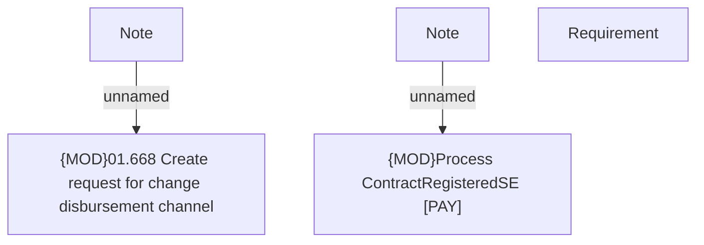

# PAYM-5786 (CBL-27569) - Monitoring improvement of disbursement channel change post contract registration - ANA - HoSel-Contract&Payments

- **Diagram Type**: Custom
- **Package**: HomerSelect/BSL/Requirements Model/In process/ISPAY/PAYM-5786 (CBL-27569) - Monitoring improvement of disbursement channel change post contract registration - ANA - HoSel-Contract&Payments
- **Diagram ID**: 162044
- **Elements**: 5
- **Connectors**: 2

