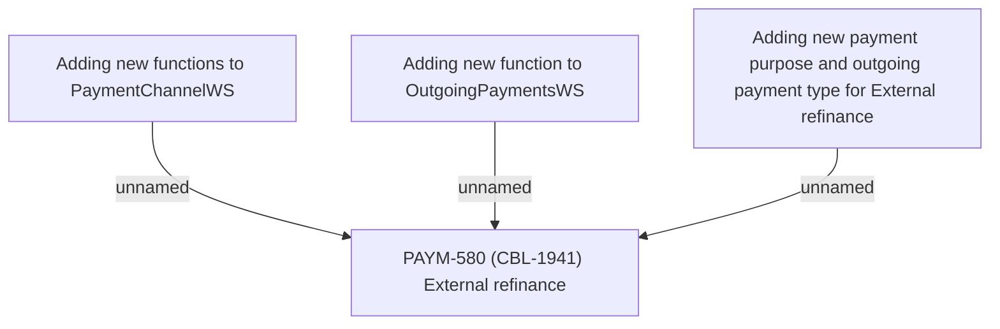

# PAYM-580 (CBL-1941) External refinance

```mermaid
graph TD
    Adding_new_functions_to_PaymentChannelWS["Adding new functions to PaymentChannelWS"]
    Adding_new_function_to_OutgoingPaymentsWS["Adding new function to OutgoingPaymentsWS"]
    Adding_new_payment_purpose_and_outgoing_payment_type_for_Ext["Adding new payment purpose and outgoing payment type for External refinance"]
    PAYM_580_CBL_1941_External_refinance["PAYM-580 (CBL-1941) External refinance"]
    Adding_new_functions_to_PaymentChannelWS -->|unnamed| PAYM_580_CBL_1941_External_refinance
    Adding_new_function_to_OutgoingPaymentsWS -->|unnamed| PAYM_580_CBL_1941_External_refinance
    Adding_new_payment_purpose_and_outgoing_payment_type_for_Ext -->|unnamed| PAYM_580_CBL_1941_External_refinance
```
