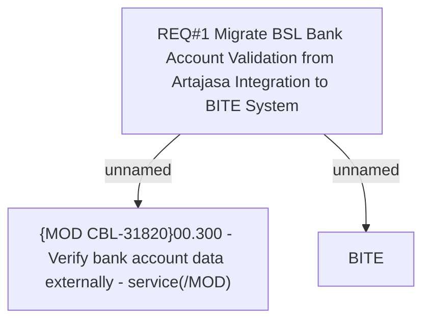

# PAYM-6304 (CBL-31820) Migrate BSL Bank Account Validation from Artajasa Integration to BITE System

- **Diagram Type**: Custom
- **Package**: HomerSelect/BSL/Requirements Model/In process/ISPAY/PAYM-6304 (CBL-31820) Migrate BSL Bank Account Validation from Artajasa Integration to BITE System
- **Diagram ID**: 164660
- **Elements**: 3
- **Connectors**: 2

