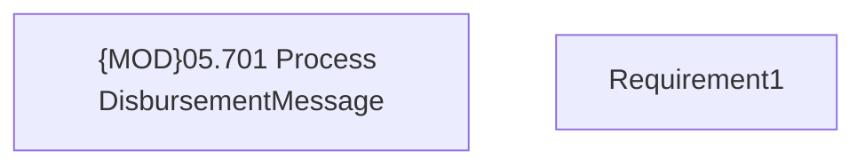

# PAYM-777 (CBL-2621) - Financing schemes IV - Subventions for REL

- **Diagram Type**: Custom
- **Package**: HomerSelect/BSL/Requirements Model/In process/ISPAY/PAYM-777 (CBL-2621) - Financing schemes IV - Subventions for REL
- **Diagram ID**: 102165
- **Elements**: 2
- **Connectors**: 0

