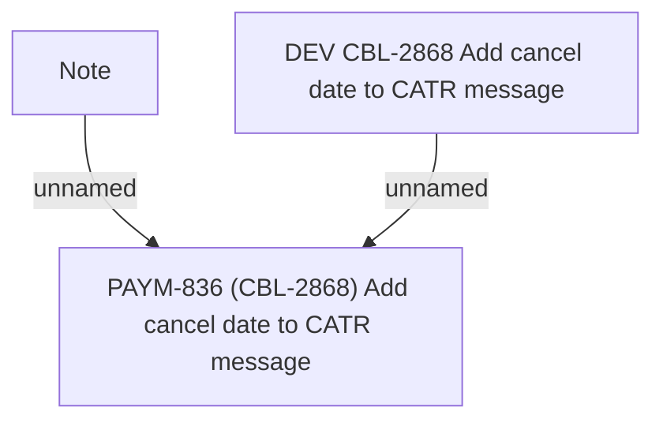

# PAYM-836 (CBL-2868) Add cancel date to CATR message

- **Diagram Type**: Custom
- **Package**: HomerSelect/BSL/Requirements Model/In process/ISPAY/PAYM-836 (CBL-2868) Add cancel date to CATR message
- **Diagram ID**: 109784
- **Elements**: 3
- **Connectors**: 2

