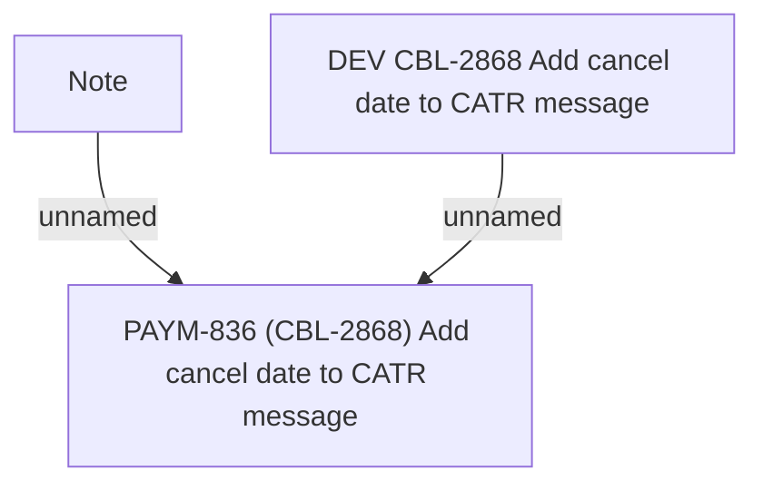

# PAYM-836 (CBL-2868) Add cancel date to CATR message

```mermaid
graph TD
    el_1332775["Note"]
    DEV_CBL_2868_Add_cancel_date_to_CATR_message["DEV CBL-2868 Add cancel date to CATR message"]
    PAYM_836_CBL_2868_Add_cancel_date_to_CATR_message["PAYM-836 (CBL-2868) Add cancel date to CATR message"]
    el_1332775 -->|unnamed| PAYM_836_CBL_2868_Add_cancel_date_to_CATR_message
    DEV_CBL_2868_Add_cancel_date_to_CATR_message -->|unnamed| PAYM_836_CBL_2868_Add_cancel_date_to_CATR_message
```
