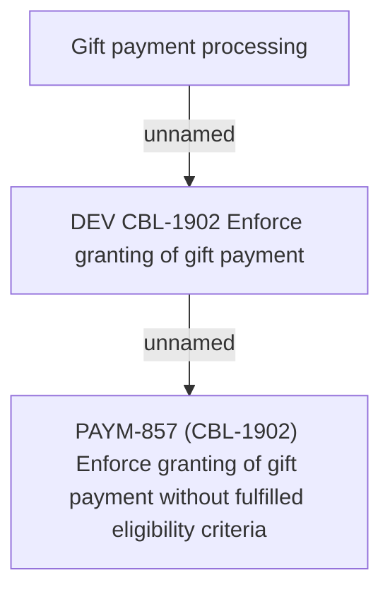

# PAYM-857 (CBL-1902) Enforce granting of gift payment without fulfilled eligibility criteria

- **Diagram Type**: Custom
- **Package**: HomerSelect/BSL/Requirements Model/In process/ISPAY/PAYM-857 (CBL-1902) Enforce granting of gift payment without fulfilled eligibility criteria
- **Diagram ID**: 116593
- **Elements**: 3
- **Connectors**: 2

