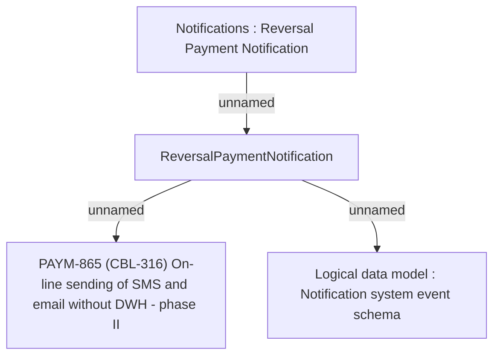

# PAYM-865 (CBL-316) On-line sending of SMS and email without DWH - phase II

- **Diagram Type**: Custom
- **Package**: HomerSelect/BSL/Requirements Model/In process/ISPAY/PAYM-865 (CBL-316) On-line sending of SMS and email without DWH - phase II
- **Diagram ID**: 104942
- **Elements**: 4
- **Connectors**: 3

