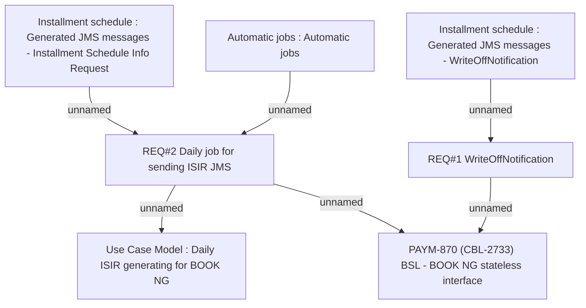

# PAYM-870 (CBL-2733) SD BSL - BOOK NG stateless interface

```mermaid
graph TD
    Automatic_jobs_Automatic_jobs["Automatic jobs : Automatic jobs"]
    Use_Case_Model_Daily_ISIR_generating_for_BOOK_NG["Use Case Model : Daily ISIR generating for BOOK NG"]
    Installment_schedule_Generated_JMS_messages_WriteOffNotifica["Installment schedule : Generated JMS messages - WriteOffNotification"]
    Installment_schedule_Generated_JMS_messages_Installment_Sche["Installment schedule : Generated JMS messages - Installment Schedule Info Request"]
    REQ_2_Daily_job_for_sending_ISIR_JMS["REQ#2 Daily job for sending ISIR JMS"]
    REQ_1_WriteOffNotification["REQ#1 WriteOffNotification"]
    PAYM_870_CBL_2733_BSL_BOOK_NG_stateless_interface["PAYM-870 (CBL-2733) BSL - BOOK NG stateless interface"]
    REQ_2_Daily_job_for_sending_ISIR_JMS -->|unnamed| Use_Case_Model_Daily_ISIR_generating_for_BOOK_NG
    Installment_schedule_Generated_JMS_messages_Installment_Sche -->|unnamed| REQ_2_Daily_job_for_sending_ISIR_JMS
    Automatic_jobs_Automatic_jobs -->|unnamed| REQ_2_Daily_job_for_sending_ISIR_JMS
    Installment_schedule_Generated_JMS_messages_WriteOffNotifica -->|unnamed| REQ_1_WriteOffNotification
    REQ_1_WriteOffNotification -->|unnamed| PAYM_870_CBL_2733_BSL_BOOK_NG_stateless_interface
    REQ_2_Daily_job_for_sending_ISIR_JMS -->|unnamed| PAYM_870_CBL_2733_BSL_BOOK_NG_stateless_interface
```
