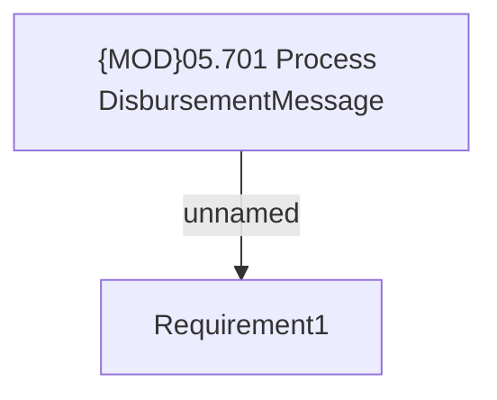

# PAYM-937 (CBL-2539) IN HCPAY - disbursement to dealers with subsidy

- **Diagram Type**: Custom
- **Package**: HomerSelect/BSL/Requirements Model/In process/ISPAY/PAYM-937 (CBL-2539) IN HCPAY - disbursement to dealers with subsidy
- **Diagram ID**: 101282
- **Elements**: 2
- **Connectors**: 1

