# PAYM-5190 BRVN-154 Overpayment process for REL

- **Diagram Type**: Custom
- **Package**: HomerSelect/BSL/Requirements Model/In process/ISPAY/VN/PAYM-5190 BRVN-154 Overpayment process for REL
- **Diagram ID**: 164102
- **Elements**: 20
- **Connectors**: 4

```mermaid
graph TD
    MOD_05_183_Process_batch_of_incoming_payment_processing_requ["{MOD}05.183 Process batch of incoming payment processing requests"]
    ADD_IncomingPaymentResponseV2["{ADD}IncomingPaymentResponseV2"]
    Generated_RMQ_messages_IncomingPaymentResponseV2["Generated RMQ messages : IncomingPaymentResponseV2"]
    MOD_Incoming_Payment_Type["{MOD}Incoming Payment Type"]
    Logical_Data_Model_Incoming_payments["Logical Data Model : Incoming payments"]
    Incoming_Payment_Channel["Incoming Payment Channel"]
    Logical_Data_Model_Incoming_payments["Logical Data Model : Incoming payments"]
    ADD_SearchPaymentsResponse["{ADD}SearchPaymentsResponse"]
    ADD_SearchPaymentsRequestDTO["{ADD}SearchPaymentsRequestDTO"]
    ADD_Search_payments_validation["{ADD}Search payments - validation"]
    Validation_Rules_Validation_Rules["Validation Rules : Validation Rules"]
    IncomingPaymentEndpoint_IncomingPaymentEndpoint_SearchPaymen["IncomingPaymentEndpoint : IncomingPaymentEndpoint - SearchPayments"]
    ADD_searchPayments["{ADD}searchPayments"]
    Use_Case_Model_Use_Case_Model["Use Case Model : Use Case Model"]
    MOD_IncomingPaymentEndpoint["{MOD}IncomingPaymentEndpoint"]
    PAYM_5190_BRVN_154_Overpayment_process_for_REL[" PAYM-5190 BRVN-154 Overpayment process for REL"]
    Rest_API_searchPayments["Rest API - searchPayments"]
    IncominigPaymentResponseV2["IncominigPaymentResponseV2"]
    Incoming_payment_channel["Incoming payment channel"]
    Incoming_payment_type["Incoming payment type"]
    ADD_searchPayments -->|unnamed| ADD_Search_payments_validation
    MOD_IncomingPaymentEndpoint -->|unnamed| ADD_SearchPaymentsRequestDTO
    MOD_IncomingPaymentEndpoint -->|unnamed| ADD_SearchPaymentsResponse
    MOD_IncomingPaymentEndpoint -->|unnamed| ADD_searchPayments
```

