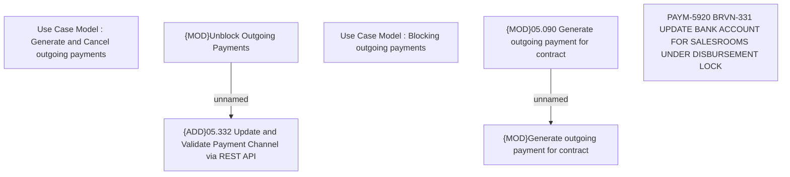

# PAYM-5920 BRVN-331 UPDATE BANK ACCOUNT FOR SALESROOMS UNDER DISBURSEMENT LOCK

- **Diagram Type**: Custom
- **Package**: HomerSelect/BSL/Requirements Model/In process/ISPAY/VN/PAYM-5920 BRVN-331 UPDATE BANK ACCOUNT FOR SALESROOMS UNDER DISBURSEMENT LOCK
- **Diagram ID**: 163951
- **Elements**: 7
- **Connectors**: 2

