# IS-998 (CBL-10543) CET via MobApp and Terminals

- **Diagram Type**: Custom
- **Package**: HomerSelect/BSL/Requirements Model/In process/IS/IS-998 (CBL-10543) CET via MobApp and Terminals
- **Diagram ID**: 134276
- **Elements**: 13
- **Connectors**: 10

```mermaid
graph TD
    MOD_08_280_Check_and_process_CET_request["{MOD}08.280 Check and process CET request"]
    Logical_Data_Model_Early_repayment_result["Logical Data Model : Early repayment result"]
    ADD_Get_Fees_charged_to_principal["{ADD}Get Fees charged to principal"]
    Get_Tariff_Items_used_for_a_Service_fees["Get Tariff Items used for a Service fees"]
    MOD_ALG_Early_repayment_calculation_A2_Unpaid_principal_only["{MOD}ALG_Early repayment calculation A2 - Unpaid principal only"]
    MOD_ALG_Early_repayment_calculation_A1["{MOD}ALG_Early repayment calculation A1"]
    MOD_03_070_Calculate_early_repayment_amount["{MOD}03.070 Calculate early repayment amount"]
    Use_Case_Contract_Early_Termination_request_creation["Use Case : Contract Early Termination request creation"]
    Use_Case_Contract_Early_Termination_processing["Use Case : Contract Early Termination processing"]
    v2_0_Contract_Insurance_Services_GET_Contract_list_Insurance["v2.0 : Contract Insurance Services - GET: Contract list Insurances"]
    v1_0_Contract_Insurance_Services_PUT_Contract_Insurance_Serv["v1.0 : Contract Insurance Services - PUT: Contract Insurance Service Cancel"]
    REQ_2_Cancel_contract_insurances_within_CET_processing["REQ #2 - Cancel contract insurances within CET processing"]
    REQ_1_Involve_insurance_amounts_into_CET_amounts_calculation["REQ #1 - Involve insurance amounts into CET amounts calculation"]
    Use_Case_Contract_Early_Termination_request_creation -->|unnamed| REQ_1_Involve_insurance_amounts_into_CET_amounts_calculation
    v2_0_Contract_Insurance_Services_GET_Contract_list_Insurance -->|unnamed| REQ_1_Involve_insurance_amounts_into_CET_amounts_calculation
    Logical_Data_Model_Early_repayment_result -->|unnamed| REQ_1_Involve_insurance_amounts_into_CET_amounts_calculation
    Use_Case_Contract_Early_Termination_processing -->|unnamed| REQ_2_Cancel_contract_insurances_within_CET_processing
    v1_0_Contract_Insurance_Services_PUT_Contract_Insurance_Serv -->|unnamed| REQ_2_Cancel_contract_insurances_within_CET_processing
    v2_0_Contract_Insurance_Services_GET_Contract_list_Insurance -->|unnamed| REQ_2_Cancel_contract_insurances_within_CET_processing
    MOD_03_070_Calculate_early_repayment_amount -->|unnamed| ADD_Get_Fees_charged_to_principal
    MOD_03_070_Calculate_early_repayment_amount -->|unnamed| MOD_ALG_Early_repayment_calculation_A1
    MOD_03_070_Calculate_early_repayment_amount -->|unnamed| MOD_ALG_Early_repayment_calculation_A2_Unpaid_principal_only
    MOD_08_280_Check_and_process_CET_request -->|unnamed| MOD_03_070_Calculate_early_repayment_amount
```

