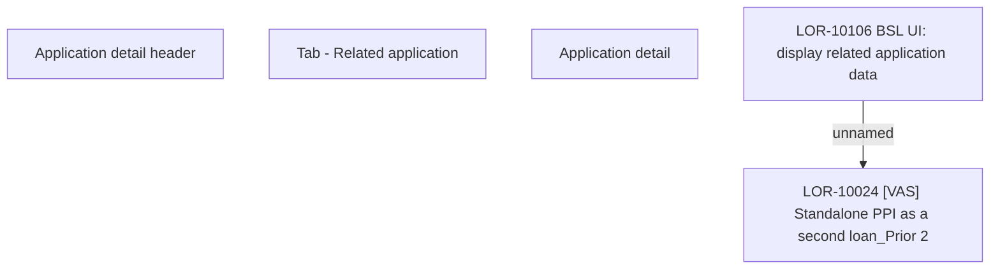

# LOR-10024 [VAS] Standalone PPI as a second loan_Prior 2

- **Diagram Type**: Custom
- **Package**: HomerSelect/BSL/Requirements Model/In process/LOR/LOR-10024 [VAS] Standalone PPI as a second loan_Prior 2
- **Diagram ID**: 157004
- **Elements**: 5
- **Connectors**: 1

