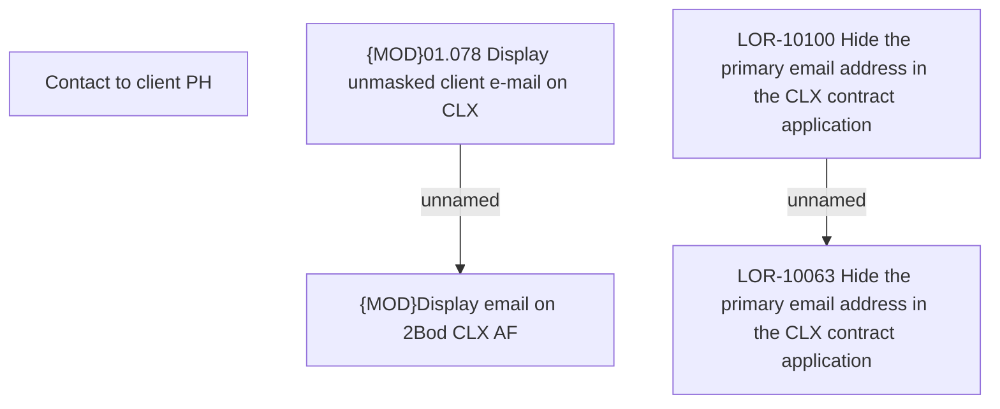

# LOR-10100 Hide the primary email address in the CLX contract application

- **Diagram Type**: Custom
- **Package**: HomerSelect/BSL/Requirements Model/In process/LOR/LOR-10063 Hide the primary email address in the CLX contract application/LOR-10100 Hide the primary email address in the CLX contract application
- **Diagram ID**: 156982
- **Elements**: 5
- **Connectors**: 2

