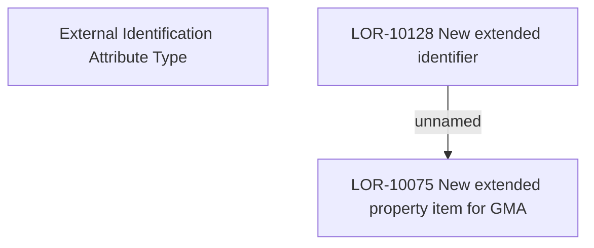

# LOR-10075 New extended property item for GMA

```mermaid
graph TD
    External_Identification_Attribute_Type["External Identification Attribute Type"]
    LOR_10075_New_extended_property_item_for_GMA["LOR-10075 New extended property item for GMA"]
    LOR_10128_New_extended_identifier["LOR-10128 New extended identifier"]
    LOR_10128_New_extended_identifier -->|unnamed| LOR_10075_New_extended_property_item_for_GMA
```
