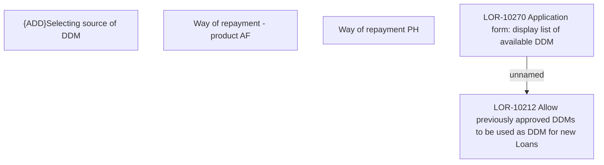

# LOR-10270 Application form: display list of available DDM

```mermaid
graph TD
    ADD_Selecting_source_of_DDM["{ADD}Selecting source of DDM"]
    Way_of_repayment_product_AF["Way of repayment - product AF"]
    Way_of_repayment_PH["Way of  repayment PH"]
    LOR_10270_Application_form_display_list_of_available_DDM["LOR-10270 Application form: display list of available DDM"]
    LOR_10212_Allow_previously_approved_DDMs_to_be_used_as_DDM_f["LOR-10212 Allow previously approved DDMs to be used as DDM for new Loans"]
    LOR_10270_Application_form_display_list_of_available_DDM -->|unnamed| LOR_10212_Allow_previously_approved_DDMs_to_be_used_as_DDM_f
```
