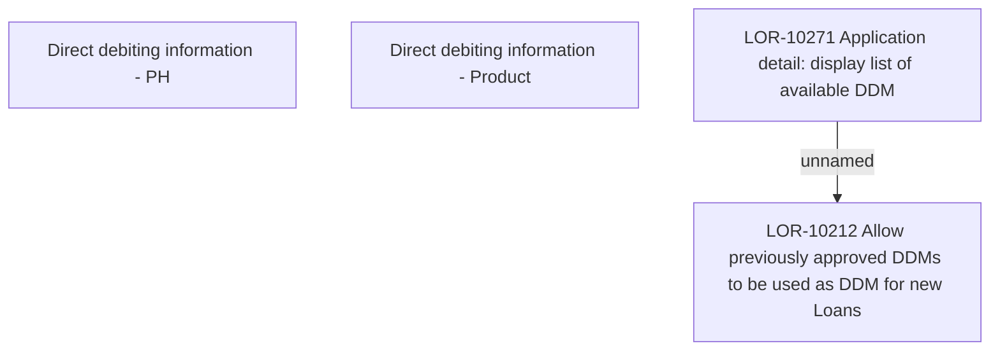

# LOR-10271 Application detail: display list of available DDM

- **Diagram Type**: Custom
- **Package**: HomerSelect/BSL/Requirements Model/In process/LOR/LOR-10212 Allow previously approved DDMs to be used as DDM for new Loans/LOR-10271 Application detail: display list of available DDM
- **Diagram ID**: 158537
- **Elements**: 4
- **Connectors**: 1

