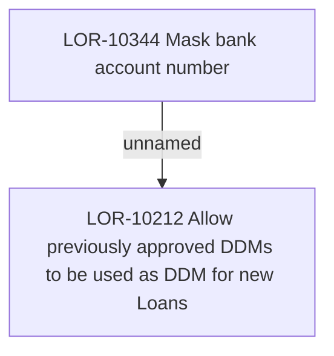

# LOR-10344 Mask bank account number

- **Diagram Type**: Custom
- **Package**: HomerSelect/BSL/Requirements Model/In process/LOR/LOR-10212 Allow previously approved DDMs to be used as DDM for new Loans/LOR-10344 Mask bank account number
- **Diagram ID**: 158538
- **Elements**: 2
- **Connectors**: 1

