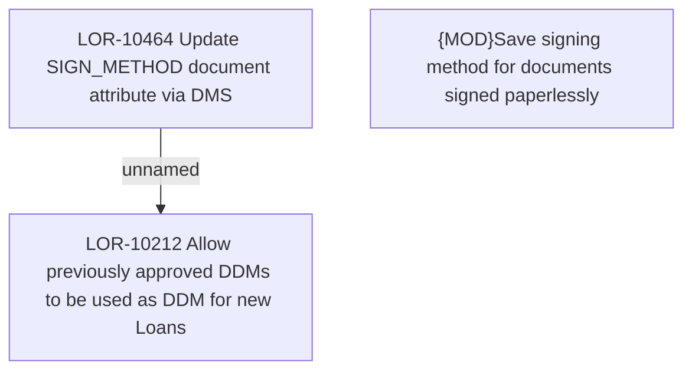

# LOR-10464 Update SIGN_METHOD document attribute via DMS

```mermaid
graph TD
    LOR_10212_Allow_previously_approved_DDMs_to_be_used_as_DDM_f["LOR-10212 Allow previously approved DDMs to be used as DDM for new Loans"]
    LOR_10464_Update_SIGN_METHOD_document_attribute_via_DMS["LOR-10464 Update SIGN_METHOD document attribute via DMS"]
    MOD_Save_signing_method_for_documents_signed_paperlessly["{MOD}Save signing method for documents signed paperlessly"]
    LOR_10464_Update_SIGN_METHOD_document_attribute_via_DMS -->|unnamed| LOR_10212_Allow_previously_approved_DDMs_to_be_used_as_DDM_f
```
