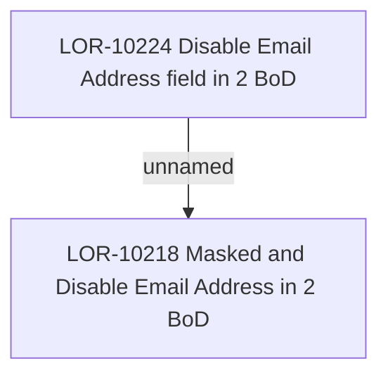

# LOR-10218 Masked and Disable Email Address in 2 BoD

```mermaid
graph TD
    LOR_10224_Disable_Email_Address_field_in_2_BoD["LOR-10224 Disable Email Address field in 2 BoD"]
    LOR_10218_Masked_and_Disable_Email_Address_in_2_BoD["LOR-10218 Masked and Disable Email Address in 2 BoD"]
    LOR_10224_Disable_Email_Address_field_in_2_BoD -->|unnamed| LOR_10218_Masked_and_Disable_Email_Address_in_2_BoD
```
