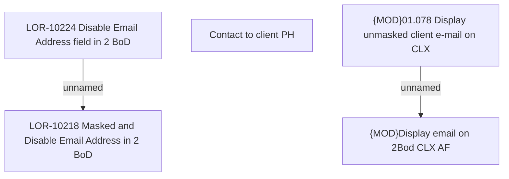

# LOR-10224 Disable Email Address field in 2 BoD

- **Diagram Type**: Custom
- **Package**: HomerSelect/BSL/Requirements Model/In process/LOR/LOR-10218 Masked and Disable Email Address in 2 BoD/LOR-10224 Disable Email Address field in 2 BoD
- **Diagram ID**: 157382
- **Elements**: 5
- **Connectors**: 2

