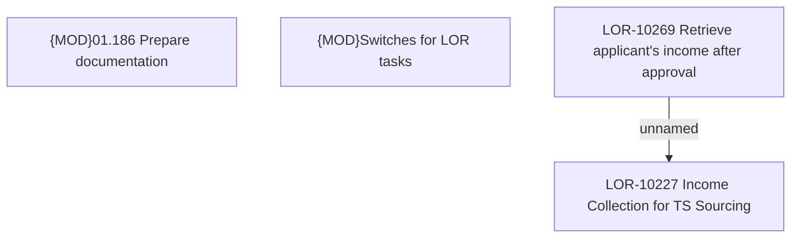

# LOR-10227 Income Collection for TS Sourcing

```mermaid
graph TD
    MOD_01_186_Prepare_documentation["{MOD}01.186 Prepare documentation"]
    MOD_Switches_for_LOR_tasks["{MOD}Switches for LOR tasks"]
    LOR_10269_Retrieve_applicant_s_income_after_approval["LOR-10269 Retrieve applicant's income after approval"]
    LOR_10227_Income_Collection_for_TS_Sourcing["LOR-10227 Income Collection for TS Sourcing"]
    LOR_10269_Retrieve_applicant_s_income_after_approval -->|unnamed| LOR_10227_Income_Collection_for_TS_Sourcing
```
