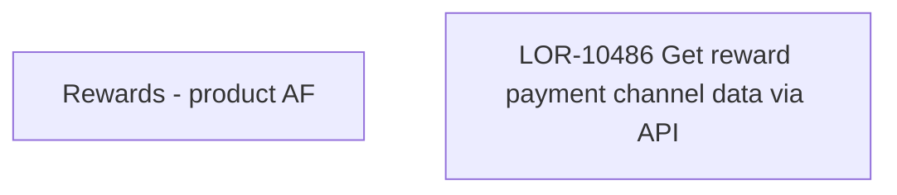

# LOR-10486 Get reward payment channel data via API

- **Diagram Type**: Custom
- **Package**: HomerSelect/BSL/Requirements Model/In process/LOR/LOR-10313 Turn on CEL Reward Payment Channel in PH/LOR-10486 Get reward payment channel data via API
- **Diagram ID**: 158786
- **Elements**: 2
- **Connectors**: 0

