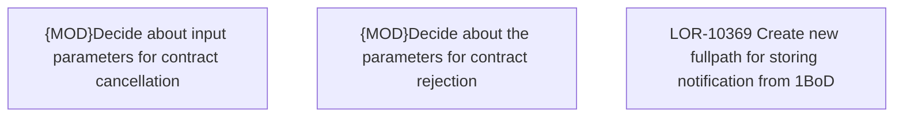

# LOR-10369 Create new fullpath for storing notification from 1BoD

```mermaid
graph TD
    MOD_Decide_about_input_parameters_for_contract_cancellation["{MOD}Decide about input parameters for contract cancellation"]
    MOD_Decide_about_the_parameters_for_contract_rejection["{MOD}Decide about the parameters for contract rejection"]
    LOR_10369_Create_new_fullpath_for_storing_notification_from_["LOR-10369 Create new fullpath for storing notification from 1BoD"]
```
