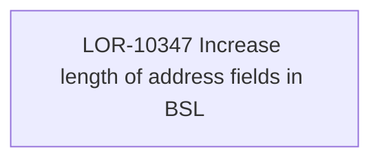

# LOR-10347 Increase length of address fields in BSL

- **Diagram Type**: Custom
- **Package**: HomerSelect/BSL/Requirements Model/In process/LOR/LOR-10347 Increase length of address fields in BSL
- **Diagram ID**: 158445
- **Elements**: 1
- **Connectors**: 0

