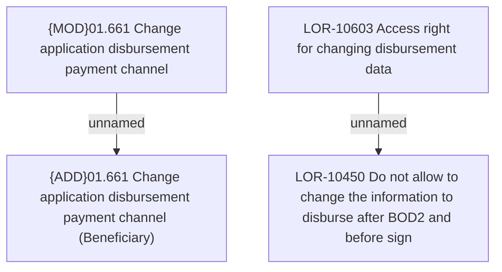

# LOR-10450 Do not allow to change the information to disburse after BOD2 and before sign

- **Diagram Type**: Custom
- **Package**: HomerSelect/BSL/Requirements Model/In process/LOR/LOR-10450 Do not allow to change the information to disburse after BOD2 and before sign
- **Diagram ID**: 159660
- **Elements**: 4
- **Connectors**: 2

