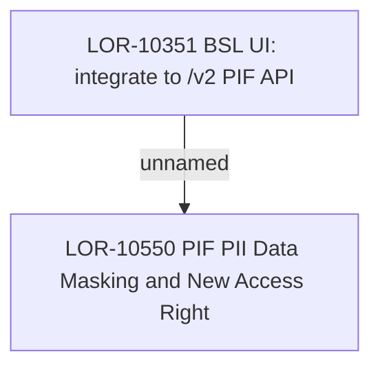

# LOR-10550 PIF PII Data Masking & New Access Right 

- **Diagram Type**: Custom
- **Package**: HomerSelect/BSL/Requirements Model/In process/LOR/LOR-10550 PIF PII Data Masking & New Access Right 
- **Diagram ID**: 159661
- **Elements**: 2
- **Connectors**: 1

