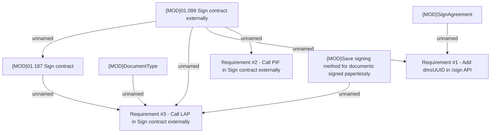

# LOR-11238 (BRPH-2104)  New Zeebe workflow for selfie esign updated signature logic

- **Diagram Type**: Custom
- **Package**: HomerSelect/BSL/Requirements Model/In process/LOR/LOR-11238 (BRPH-2104)  New Zeebe workflow for selfie esign updated signature logic
- **Diagram ID**: 164676
- **Elements**: 8
- **Connectors**: 8

