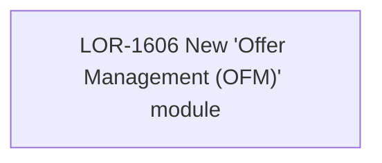

# LOR-1606 New "Offer Management (OFM)" module

- **Diagram Type**: Custom
- **Package**: HomerSelect/BSL/Requirements Model/In process/LOR/LOR-1606 New "Offer Management (OFM)" module
- **Diagram ID**: 148516
- **Elements**: 1
- **Connectors**: 0

