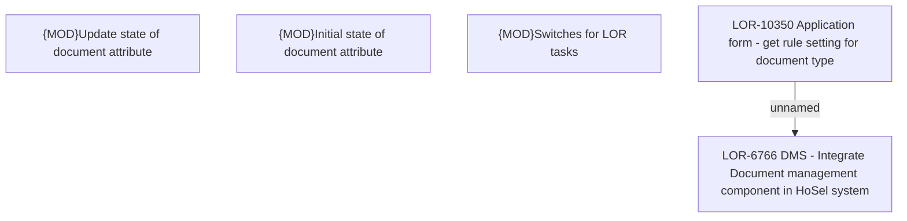

# LOR-10350 Application form - get rule setting for document type

```mermaid
graph TD
    MOD_Update_state_of_document_attribute["{MOD}Update state of document attribute"]
    MOD_Initial_state_of_document_attribute["{MOD}Initial state of document attribute"]
    MOD_Switches_for_LOR_tasks["{MOD}Switches for LOR tasks"]
    LOR_10350_Application_form_get_rule_setting_for_document_typ["LOR-10350 Application form - get rule setting for document type"]
    LOR_6766_DMS_Integrate_Document_management_component_in_HoSe["LOR-6766 DMS - Integrate Document management component in HoSel system"]
    LOR_10350_Application_form_get_rule_setting_for_document_typ -->|unnamed| LOR_6766_DMS_Integrate_Document_management_component_in_HoSe
```
