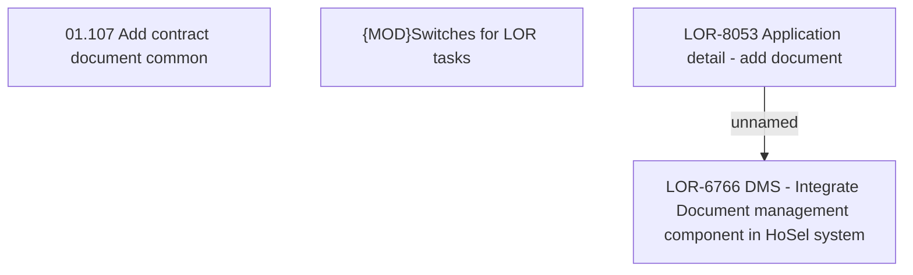

# LOR-8053 Application detail - add document

```mermaid
graph TD
    n_01_107_Add_contract_document_common["01.107 Add contract document common"]
    MOD_Switches_for_LOR_tasks["{MOD}Switches for LOR tasks"]
    LOR_8053_Application_detail_add_document["LOR-8053 Application detail - add document"]
    LOR_6766_DMS_Integrate_Document_management_component_in_HoSe["LOR-6766 DMS - Integrate Document management component in HoSel system"]
    LOR_8053_Application_detail_add_document -->|unnamed| LOR_6766_DMS_Integrate_Document_management_component_in_HoSe
```
