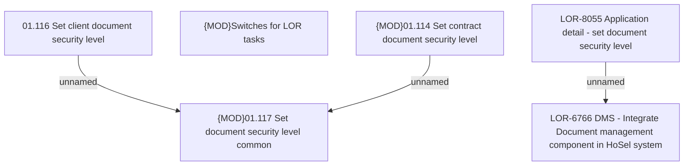

# LOR-8055 Application detail - set document security level

```mermaid
graph TD
    MOD_01_114_Set_contract_document_security_level["{MOD}01.114 Set contract document security level"]
    MOD_01_117_Set_document_security_level_common["{MOD}01.117 Set document security level common"]
    MOD_Switches_for_LOR_tasks["{MOD}Switches for LOR tasks"]
    n_01_116_Set_client_document_security_level["01.116 Set client document security level"]
    LOR_8055_Application_detail_set_document_security_level["LOR-8055 Application detail - set document security level"]
    LOR_6766_DMS_Integrate_Document_management_component_in_HoSe["LOR-6766 DMS - Integrate Document management component in HoSel system"]
    LOR_8055_Application_detail_set_document_security_level -->|unnamed| LOR_6766_DMS_Integrate_Document_management_component_in_HoSe
    n_01_116_Set_client_document_security_level -->|unnamed| MOD_01_117_Set_document_security_level_common
    MOD_01_114_Set_contract_document_security_level -->|unnamed| MOD_01_117_Set_document_security_level_common
```
