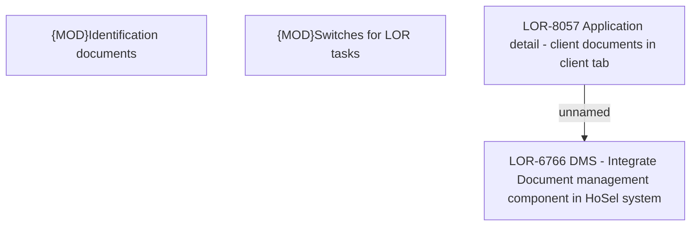

# LOR-8057 Application detail - client documents in client tab

```mermaid
graph TD
    MOD_Identification_documents["{MOD}Identification documents"]
    MOD_Switches_for_LOR_tasks["{MOD}Switches for LOR tasks"]
    LOR_8057_Application_detail_client_documents_in_client_tab["LOR-8057 Application detail - client documents in client tab"]
    LOR_6766_DMS_Integrate_Document_management_component_in_HoSe["LOR-6766 DMS - Integrate Document management component in HoSel system"]
    LOR_8057_Application_detail_client_documents_in_client_tab -->|unnamed| LOR_6766_DMS_Integrate_Document_management_component_in_HoSe
```
