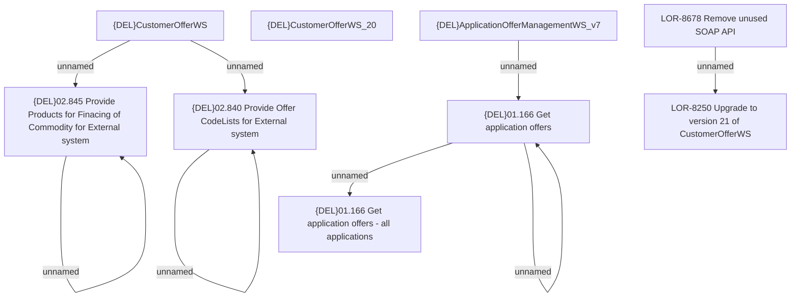

# LOR-8250 Upgrade to version 21 of CustomerOfferWS

```mermaid
graph TD
    DEL_02_845_Provide_Products_for_Finacing_of_Commodity_for_Ex["{DEL}02.845 Provide Products for Finacing of Commodity for External system"]
    DEL_02_845_Provide_Products_for_Finacing_of_Commodity_for_Ex["{DEL}02.845 Provide Products for Finacing of Commodity for External system"]
    DEL_02_840_Provide_Offer_CodeLists_for_External_system["{DEL}02.840 Provide Offer CodeLists for External system"]
    DEL_CustomerOfferWS["{DEL}CustomerOfferWS"]
    DEL_02_840_Provide_Offer_CodeLists_for_External_system["{DEL}02.840 Provide Offer CodeLists for External system"]
    DEL_CustomerOfferWS_20["{DEL}CustomerOfferWS_20"]
    DEL_ApplicationOfferManagementWS_v7["{DEL}ApplicationOfferManagementWS_v7"]
    DEL_01_166_Get_application_offers_all_applications["{DEL}01.166 Get application offers - all applications"]
    DEL_01_166_Get_application_offers["{DEL}01.166 Get application offers"]
    DEL_01_166_Get_application_offers["{DEL}01.166 Get application offers"]
    LOR_8678_Remove_unused_SOAP_API["LOR-8678 Remove unused SOAP API"]
    LOR_8250_Upgrade_to_version_21_of_CustomerOfferWS["LOR-8250 Upgrade to version 21 of CustomerOfferWS"]
    DEL_02_845_Provide_Products_for_Finacing_of_Commodity_for_Ex -->|unnamed| DEL_02_845_Provide_Products_for_Finacing_of_Commodity_for_Ex
    DEL_CustomerOfferWS -->|unnamed| DEL_02_845_Provide_Products_for_Finacing_of_Commodity_for_Ex
    DEL_CustomerOfferWS -->|unnamed| DEL_02_840_Provide_Offer_CodeLists_for_External_system
    DEL_02_840_Provide_Offer_CodeLists_for_External_system -->|unnamed| DEL_02_840_Provide_Offer_CodeLists_for_External_system
    LOR_8678_Remove_unused_SOAP_API -->|unnamed| LOR_8250_Upgrade_to_version_21_of_CustomerOfferWS
    DEL_ApplicationOfferManagementWS_v7 -->|unnamed| DEL_01_166_Get_application_offers
    DEL_01_166_Get_application_offers -->|unnamed| DEL_01_166_Get_application_offers_all_applications
    DEL_01_166_Get_application_offers -->|unnamed| DEL_01_166_Get_application_offers
```
