# LOR-8421 LOR - remove KZ custom behavior of BSL

- **Diagram Type**: Custom
- **Package**: HomerSelect/BSL/Requirements Model/In process/LOR/LOR-8421 LOR - remove KZ custom behavior of BSL
- **Diagram ID**: 152011
- **Elements**: 12
- **Connectors**: 4

```mermaid
graph TD
    LOR_8989_Remove_InitiateEvaluationRequest_functionality["LOR-8989 - Remove InitiateEvaluationRequest functionality"]
    LOR_8989_Remove_InitiateEvaluationRequest_functionality["LOR-8989 - Remove InitiateEvaluationRequest functionality"]
    LOR_8437_Remove_functionality_related_to_dataSource_getSales["LOR-8437 - Remove functionality related to dataSource.getSalesAgentDataFromHomeSIS"]
    LOR_8824_Remove_functionality_related_to_global_parameter_DO["LOR-8824 - Remove functionality related to global parameter DOCUMENT_QUALITY_CHECK"]
    LOR_8726_RELIP_cleanup_datasource["LOR-8726 RELIP cleanup - datasource"]
    LOR_8726_RELIP_cleanup_datasource["LOR-8726 - RELIP cleanup - datasource"]
    LOR_8829_Remove_functionality_related_to_creation_of_approva["LOR-8829 Remove functionality related to creation of approval result documents"]
    LOR_8829_Remove_functionality_related_to_creation_of_approva["LOR-8829 Remove functionality related to creation of approval result documents"]
    LOR_8426_Remove_functionality_related_to_showDeliveryManagem["LOR-8426 Remove functionality related to showDeliveryManagementTab"]
    LOR_8432_Remove_temporary_switches["LOR-8432 - Remove temporary switches"]
    LOR_8421_LOR_remove_KZ_custom_behavior_of_BSL["LOR-8421 LOR - remove KZ custom behavior of BSL"]
    LOR_8824_Remove_functionality_related_to_global_parameter_DO["LOR-8824 - Remove functionality related to global parameter DOCUMENT_QUALITY_CHECK"]
    LOR_8824_Remove_functionality_related_to_global_parameter_DO -->|unnamed| LOR_8421_LOR_remove_KZ_custom_behavior_of_BSL
    LOR_8829_Remove_functionality_related_to_creation_of_approva -->|unnamed| LOR_8421_LOR_remove_KZ_custom_behavior_of_BSL
    LOR_8726_RELIP_cleanup_datasource -->|unnamed| LOR_8421_LOR_remove_KZ_custom_behavior_of_BSL
    LOR_8989_Remove_InitiateEvaluationRequest_functionality -->|unnamed| LOR_8421_LOR_remove_KZ_custom_behavior_of_BSL
```

