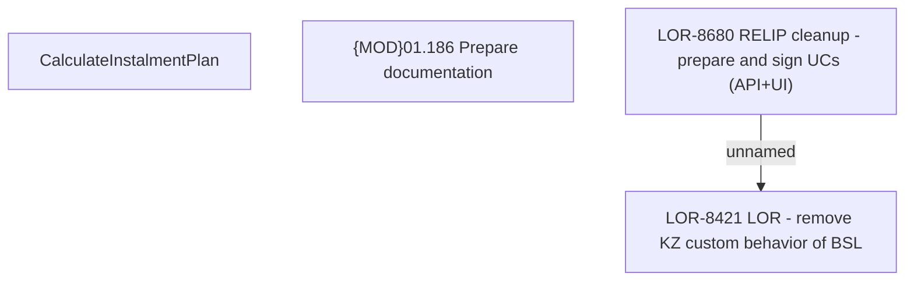

# LOR-8680 RELIP cleanup - prepare and sign UCs (API+UI)

- **Diagram Type**: Custom
- **Package**: HomerSelect/BSL/Requirements Model/In process/LOR/LOR-8421 LOR - remove KZ custom behavior of BSL/LOR-8680 RELIP cleanup - prepare and sign UCs (API+UI)
- **Diagram ID**: 152012
- **Elements**: 4
- **Connectors**: 1

