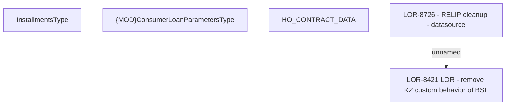

# LOR-8726 RELIP cleanup - datasource

```mermaid
graph TD
    InstallmentsType["InstallmentsType"]
    MOD_ConsumerLoanParametersType["{MOD}ConsumerLoanParametersType"]
    HO_CONTRACT_DATA["HO_CONTRACT_DATA"]
    LOR_8421_LOR_remove_KZ_custom_behavior_of_BSL["LOR-8421 LOR - remove KZ custom behavior of BSL"]
    LOR_8726_RELIP_cleanup_datasource["LOR-8726 - RELIP cleanup - datasource"]
    LOR_8726_RELIP_cleanup_datasource -->|unnamed| LOR_8421_LOR_remove_KZ_custom_behavior_of_BSL
```
