# LOR-8824 - Remove functionality related to global parameter DOCUMENT_QUALITY_CHECK

- **Diagram Type**: Custom
- **Package**: HomerSelect/BSL/Requirements Model/In process/LOR/LOR-8421 LOR - remove KZ custom behavior of BSL/LOR-8824 - Remove functionality related to global parameter DOCUMENT_QUALITY_CHECK
- **Diagram ID**: 152014
- **Elements**: 9
- **Connectors**: 0

```mermaid
graph TD
    MOD_Validation_result["{MOD}Validation result"]
    MOD_Validation_of_photo_is_in_progress["{MOD}Validation of photo is in progress"]
    n_01_088_Upload_file["01.088 Upload file"]
    n_01_080_Fill_in_application["01.080 Fill in application"]
    MOD_Contract_Origination_Global_Parameter["{MOD}Contract Origination Global Parameter"]
    MOD_System_event_processing_setting["{MOD}System event processing setting"]
    MOD_Switches_for_LOR_tasks["{MOD}Switches for LOR tasks"]
    LOR_8824_Remove_functionality_related_to_global_parameter_DO["LOR-8824 - Remove functionality related to global parameter DOCUMENT_QUALITY_CHECK"]
    LOR_8421_LOR_remove_KZ_custom_behavior_of_BSL["LOR-8421 LOR - remove KZ custom behavior of BSL"]
```

