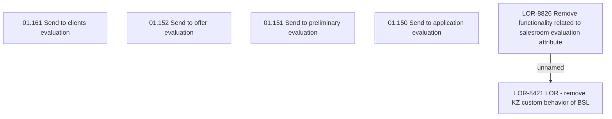

# LOR-8826 Remove functionality related to salesroom evaluation attribute

- **Diagram Type**: Custom
- **Package**: HomerSelect/BSL/Requirements Model/In process/LOR/LOR-8421 LOR - remove KZ custom behavior of BSL/LOR-8826 Remove functionality related to salesroom evaluation attribute
- **Diagram ID**: 152015
- **Elements**: 6
- **Connectors**: 1

