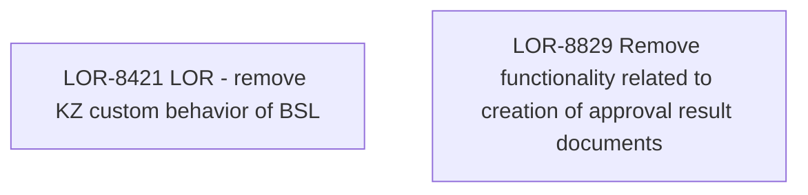

# LOR-8829 Remove functionality related to creation of approval result documents

- **Diagram Type**: Custom
- **Package**: HomerSelect/BSL/Requirements Model/In process/LOR/LOR-8421 LOR - remove KZ custom behavior of BSL/LOR-8829 Remove functionality related to creation of approval result documents
- **Diagram ID**: 152016
- **Elements**: 2
- **Connectors**: 0

