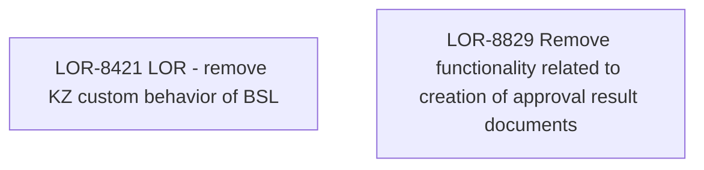

# LOR-8829 Remove functionality related to creation of approval result documents

```mermaid
graph TD
    LOR_8421_LOR_remove_KZ_custom_behavior_of_BSL["LOR-8421 LOR - remove KZ custom behavior of BSL"]
    LOR_8829_Remove_functionality_related_to_creation_of_approva["LOR-8829 Remove functionality related to creation of approval result documents"]
```
