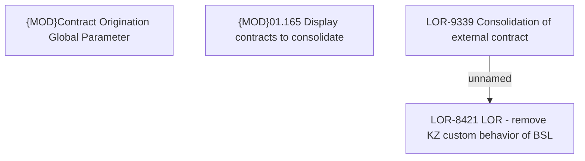

# LOR-9339 Consolidation of external contract

- **Diagram Type**: Custom
- **Package**: HomerSelect/BSL/Requirements Model/In process/LOR/LOR-8421 LOR - remove KZ custom behavior of BSL/LOR-9339 Consolidation of external contract
- **Diagram ID**: 152018
- **Elements**: 4
- **Connectors**: 1

