# LOR-9041 - Unified DDM (ADA)

- **Diagram Type**: Custom
- **Package**: HomerSelect/BSL/Requirements Model/In process/LOR/LOR-9041 - Unified DDM (ADA)
- **Diagram ID**: 152944
- **Elements**: 40
- **Connectors**: 17

```mermaid
graph TD
    LOR_9433_Use_Agreement_Verification_instead_of_Document_Veri["LOR-9433 - Use Agreement_Verification instead of Document_Verification in HO_CONTRACT_DATA data source"]
    LOR_9433_Use_Agreement_Verification_instead_of_Document_Veri["LOR-9433 - Use Agreement_Verification instead of Document_Verification in HO_CONTRACT_DATA data source"]
    LOR_9440_Adjust_logic_of_direct_debit_mandate_data_prefillin["LOR-9440 - Adjust logic of direct debit mandate data prefilling onto application form"]
    LOR_9440_Adjust_logic_of_direct_debit_mandate_data_prefillin["LOR-9440 - Adjust logic of direct debit mandate data prefilling onto application form"]
    LOR_9422_Propagate_DDM_documents_into_HO_CONTRACT_DATA_and_A["LOR-9422 - Propagate DDM documents into HO_CONTRACT_DATA and ApplicationManagementWS"]
    LOR_9420_Adjust_storing_of_document_signing_method["LOR-9420 - Adjust storing of document signing method"]
    LOR_9422_Propagate_DDM_documents_into_HO_CONTRACT_DATA_and_A["LOR-9422 - Propagate DDM documents into HO_CONTRACT_DATA and ApplicationManagementWS"]
    LOR_9420_Adjust_storing_of_document_signing_method["LOR-9420 - Adjust storing of document signing method"]
    LOR_9414_Remove_usage_of_global_parameter_DDM_CHANGE_BA_FOR_["LOR-9414 - Remove usage of global parameter DDM_CHANGE_BA_FOR_DCH from LOR domain"]
    LOR_9414_Remove_usage_of_global_parameter_DDM_CHANGE_BA_FOR_["LOR-9414 - Remove usage of global parameter DDM_CHANGE_BA_FOR_DCH from LOR domain"]
    LOR_9397_Automatically_create_DDM_documents_with_DDC_check_m["LOR-9397 - Automatically create DDM documents with DDC check moment upon submitting application form"]
    LOR_9397_Automatically_create_DDM_documents_with_DDC_check_m["LOR-9397 - Automatically create DDM documents with DDC check moment upon submitting application form"]
    LOR_9381_Update_direct_debit_mandate_ECS_provider_from_Appli["LOR-9381 - Update direct debit mandate ECS provider from Application detail via DDM REST API"]
    LOR_9366_Get_direct_debit_mandate_data_for_ApplicationManage["LOR-9366 - Get direct debit mandate data for ApplicationManagement REST via PAYM API"]
    LOR_9366_Get_direct_debit_mandate_data_for_ApplicationManage["LOR-9366 - Get direct debit mandate data for ApplicationManagement REST via PAYM API"]
    LOR_9381_Update_direct_debit_mandate_ECS_provider_from_Appli["LOR-9381 - Update direct debit mandate ECS provider from Application detail via DDM REST API"]
    LOR_9359_Completely_remove_sign_pad_feature["LOR-9359 - Completely remove sign pad feature"]
    LOR_9359_Completely_remove_sign_pad_feature["LOR-9359 - Completely remove sign pad feature"]
    LOR_9344_Get_direct_debit_mandate_data_for_ApplicationPaymen["LOR-9344 - Get direct debit mandate data for ApplicationPaymentChannelManagementWS via PAYM API"]
    LOR_9344_Get_direct_debit_mandate_data_for_ApplicationPaymen["LOR-9344 - Get direct debit mandate data for ApplicationPaymentChannelManagementWS via PAYM API"]
    LOR_9343_Use_ApplicationManagement_REST_instead_of_Applicati["LOR-9343 - Use ApplicationManagement REST instead of ApplicationManagementWS v23 in DSM"]
    LOR_9343_Use_ApplicationManagement_REST_instead_of_Applicati["LOR-9343 - Use ApplicationManagement REST instead of ApplicationManagementWS v23 in DSM"]
    LOR_9342_Validate_direct_debit_mandates_via_DDM_REST_API["LOR-9342 - Validate direct debit mandates via DDM REST API"]
    LOR_9342_Validate_direct_debit_mandates_via_DDM_REST_API["LOR-9342 - Validate direct debit mandates via DDM REST API"]
    LOR_9340_DDM_REST_API_Implement_PUT_method_for_updating_ECS_["LOR-9340 - DDM REST API - Implement PUT method for updating ECS provider on DDM / DDM draft"]
    LOR_9340_DDM_REST_API_Implement_PUT_method_for_updating_ECS_["LOR-9340 - DDM REST API - Implement PUT method for updating ECS provider on DDM / DDM draft"]
    LOR_9326_Get_direct_debit_mandate_data_for_HO_CONTRACT_DATA_["LOR-9326 - Get direct debit mandate data for HO_CONTRACT_DATA data source via PAYM API"]
    LOR_9326_Get_direct_debit_mandate_data_for_HO_CONTRACT_DATA_["LOR-9326 - Get direct debit mandate data for HO_CONTRACT_DATA data source via PAYM API"]
    LOR_9325_Create_direct_debit_mandate_from_Application_detail["LOR-9325 - Create direct debit mandate from Application detail via DDM REST API"]
    LOR_9325_Create_direct_debit_mandate_from_Application_detail["LOR-9325 - Create direct debit mandate from Application detail via DDM REST API"]
    LOR_9306_Update_direct_debit_mandate_from_Application_detail["LOR-9306 - Update direct debit mandate from Application detail via DDM REST API"]
    LOR_9290_Copy_DDM_references_from_application_to_contract["LOR-9290 - Copy DDM references from application to contract"]
    LOR_9290_Copy_DDM_references_from_application_to_contract["LOR-9290 - Copy DDM references from application to contract"]
    el_1764205["Note"]
    LOR_9306_Update_direct_debit_mandate_from_Application_detail["LOR-9306 - Update direct debit mandate from Application detail via DDM REST API"]
    LOR_9041_Unified_DDM_ADA["LOR-9041 - Unified DDM (ADA)"]
    LOR_9257_Get_direct_debit_mandate_data_for_application_form_["LOR-9257 - Get direct debit mandate data for application form prefilling via DDM REST API"]
    LOR_9180_Create_DDM_document_automatically_upon_creating_DDM["LOR-9180 - Create DDM document automatically upon creating DDM draft"]
    LOR_9180_Create_DDM_document_automatically_upon_creating_DDM["LOR-9180 - Create DDM document automatically upon creating DDM draft"]
    LOR_9257_Get_direct_debit_mandate_data_for_application_form_["LOR-9257 - Get direct debit mandate data for application form prefilling via DDM REST API"]
    LOR_9344_Get_direct_debit_mandate_data_for_ApplicationPaymen -->|unnamed| LOR_9041_Unified_DDM_ADA
    LOR_9440_Adjust_logic_of_direct_debit_mandate_data_prefillin -->|unnamed| LOR_9041_Unified_DDM_ADA
    LOR_9422_Propagate_DDM_documents_into_HO_CONTRACT_DATA_and_A -->|unnamed| LOR_9041_Unified_DDM_ADA
    LOR_9420_Adjust_storing_of_document_signing_method -->|unnamed| LOR_9041_Unified_DDM_ADA
    LOR_9414_Remove_usage_of_global_parameter_DDM_CHANGE_BA_FOR_ -->|unnamed| LOR_9041_Unified_DDM_ADA
    LOR_9397_Automatically_create_DDM_documents_with_DDC_check_m -->|unnamed| LOR_9041_Unified_DDM_ADA
    LOR_9381_Update_direct_debit_mandate_ECS_provider_from_Appli -->|unnamed| LOR_9041_Unified_DDM_ADA
    LOR_9343_Use_ApplicationManagement_REST_instead_of_Applicati -->|unnamed| LOR_9041_Unified_DDM_ADA
    LOR_9433_Use_Agreement_Verification_instead_of_Document_Veri -->|unnamed| LOR_9041_Unified_DDM_ADA
    LOR_9359_Completely_remove_sign_pad_feature -->|unnamed| LOR_9041_Unified_DDM_ADA
    LOR_9342_Validate_direct_debit_mandates_via_DDM_REST_API -->|unnamed| LOR_9041_Unified_DDM_ADA
    LOR_9340_DDM_REST_API_Implement_PUT_method_for_updating_ECS_ -->|unnamed| LOR_9041_Unified_DDM_ADA
    LOR_9326_Get_direct_debit_mandate_data_for_HO_CONTRACT_DATA_ -->|unnamed| LOR_9041_Unified_DDM_ADA
    LOR_9325_Create_direct_debit_mandate_from_Application_detail -->|unnamed| LOR_9041_Unified_DDM_ADA
    LOR_9306_Update_direct_debit_mandate_from_Application_detail -->|unnamed| LOR_9041_Unified_DDM_ADA
    LOR_9290_Copy_DDM_references_from_application_to_contract -->|unnamed| LOR_9041_Unified_DDM_ADA
    LOR_9366_Get_direct_debit_mandate_data_for_ApplicationManage -->|unnamed| LOR_9041_Unified_DDM_ADA
```

