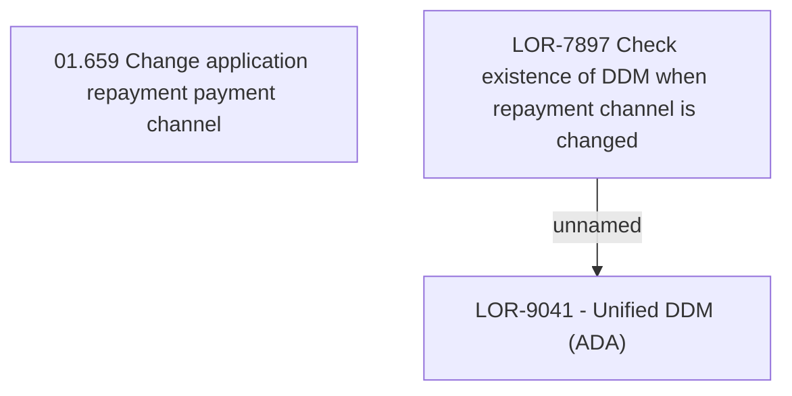

# LOR-7897 Check existence of DDM when repayment channel is changed

```mermaid
graph TD
    n_01_659_Change_application_repayment_payment_channel["01.659 Change application repayment payment channel"]
    LOR_7897_Check_existence_of_DDM_when_repayment_channel_is_ch["LOR-7897 Check existence of DDM when repayment channel is changed"]
    LOR_9041_Unified_DDM_ADA["LOR-9041 - Unified DDM (ADA)"]
    LOR_7897_Check_existence_of_DDM_when_repayment_channel_is_ch -->|unnamed| LOR_9041_Unified_DDM_ADA
```
