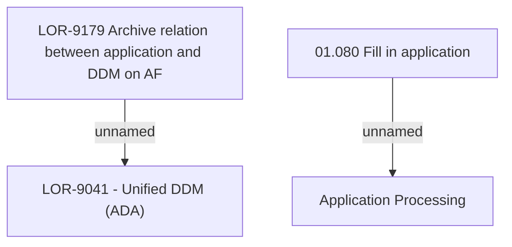

# LOR-9179 Archive relation between application and DDM on AF

- **Diagram Type**: Custom
- **Package**: HomerSelect/BSL/Requirements Model/In process/LOR/LOR-9041 - Unified DDM (ADA)/LOR-9179 Archive relation between application and DDM on AF
- **Diagram ID**: 152946
- **Elements**: 4
- **Connectors**: 2

