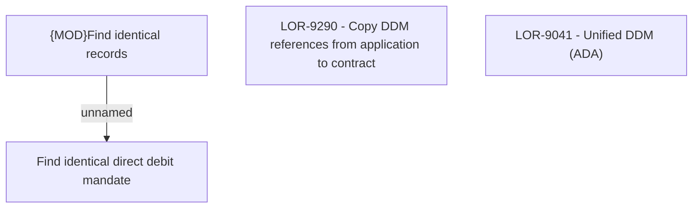

# LOR-9290 - Copy DDM references from application to contract

- **Diagram Type**: Custom
- **Package**: HomerSelect/BSL/Requirements Model/In process/LOR/LOR-9041 - Unified DDM (ADA)/LOR-9290 - Copy DDM references from application to contract
- **Diagram ID**: 152947
- **Elements**: 4
- **Connectors**: 1

